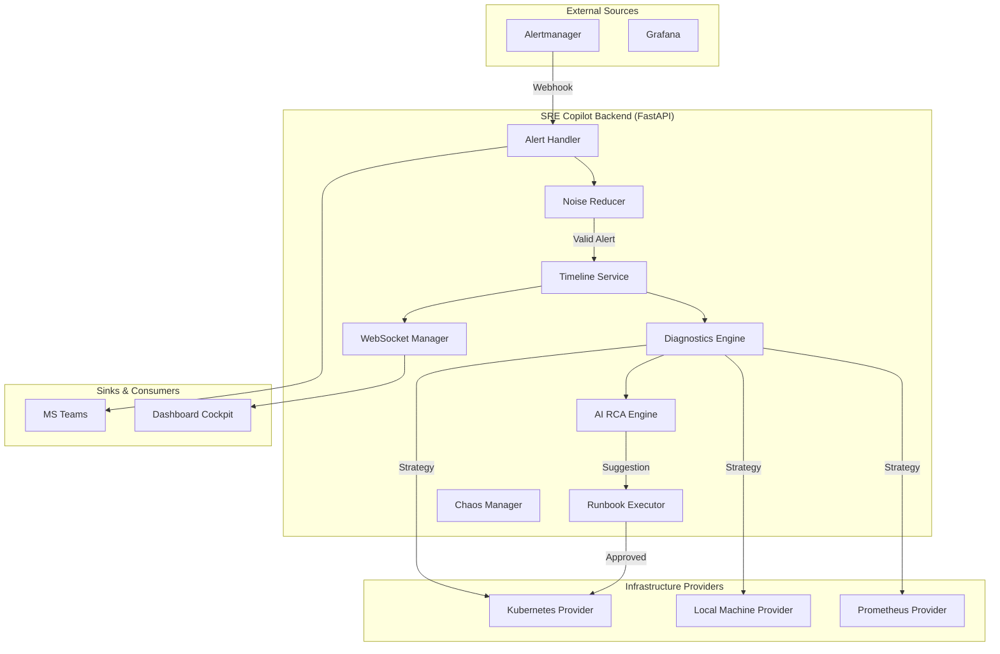

# Backend Architecture: SRE Copilot

## 1. System Overview
SRE Copilot is a Python-based asynchronous service built with **FastAPI**. It serves as an intelligent intermediary between monitoring systems (like Prometheus Alertmanager) and SRE teams. The system automates the manual triage process: from alert ingestion and diagnostic collection to AI-driven root cause analysis and runbook execution.

## 2. High-Level Architecture

## 3. Core Modules & Responsibilities

### 3.1 Alert Handler (`alert_handler.py`)
- The entry point for all incoming webhooks.
- Orchestrates the background pipeline tasks (`process_alert_background`).
- Manages the lifecycle transitions (Firing -> Investigating -> RCA Available -> Resolved).

### 3.2 Noise Reducer (`noise_reduction.py`)
- **Deduplication**: Uses deterministic fingerprinting based on alert labels.
- **Suppression**: Implements maintenance windows and CEL (Common Expression Language) filtering.
- **Storm Protection**: Drops rapid-fire duplicate alerts to prevent API overload.

### 3.3 Timeline Manager (`timeline.py`)
- Maintains the state of all active and resolved incidents.
- Records a detailed audit trail of events (e.g., "Diagnostics collected", "Runbook approved").
- **Reporting**: Generates the final Markdown post-mortem reports for high-severity incidents.

### 3.4 Diagnostics Engine & Providers (`diagnostics.py` + `providers/`)
- Implements the **Facade Pattern** to gather diagnostics from multiple sources.
- **Provider Architecture**: Decouples the logic for Kubernetes, Local Processes, and Prometheus metrics.
- Uses the **Strategy Pattern** to select the right provider based on alert labels (e.g., if a `pod` label exists, use `KubernetesProvider`).

### 3.5 AI Analysis Engine (`ai_analysis.py`)
- Interfaces with OpenAI (or mock fallbacks).
- **Prompt Engineering**: Constructs context-rich prompts including raw logs, pod events, and cluster health.
- Parses unstructured AI output into structured summaries for the dashboard.

### 3.6 WebSocket Manager (`ws_manager.py`)
- Handles real-time, low-latency communication with the frontend.
- Broadcasts incident updates (`INCIDENT_UPDATE`), new timeline events (`EVENT_ADDED`), and execution results.

## 4. Data Lifecycle

1.  **Ingest**: Alertmanager sends a `firing` webhook.
2.  **Filter**: `NoiseReducer` checks maintenance windows and deduplicates.
3.  **Create**: `TimelineManager` initializes a new `IncidentState`.
4.  **Diagnose**: `DiagnosticsEngine` fetches K8s events/logs for the specific pod/namespace.
5.  **Analyze**: AI generates a Root Cause Analysis (RCA) report and suggests a runbook.
6.  **Remediate**: An SRE clicks "Approve" on the dashboard; `RunbookExecutor` executes the script.
7.  **Resolve**: Alertmanager sends a `resolved` webhook; `TimelineManager` generates a post-mortem.

## 5. Technology Stack Rationale

- **FastAPI**: Chosen for its high performance and built-in support for asynchronous operations (`async/await`), which is critical for long-running diagnostic and AI tasks.
- **Pydantic**: Provides robust data validation for complex Alertmanager and Kubernetes schemas.
- **WebSockets**: Essential for the "Industrial Command Center" experience, providing instant feedback without polling.
- **celpy**: Used for high-performance CEL evaluation in the noise reduction pipeline, allowing for complex filtering rules.
